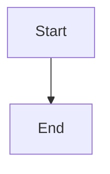

# gem-ci Documentation

This directory contains the Jekyll-based documentation for gem-ci.

## Local Development Setup

### Prerequisites
- Ruby 3.3+ installed
- Bundler gem installed

### Setup Instructions

1. **Navigate to docs directory:**
   ```bash
   cd docs
   ```

2. **Install dependencies:**
   ```bash
   bundle install
   ```

3. **Run Jekyll development server:**
   ```bash
   bundle exec jekyll serve
   ```

4. **Open in browser:**
   - Local site: http://localhost:4000/gem-ci/
   - The site will auto-rebuild when you make changes

### Alternative Ports

If port 4000 is in use:
```bash
bundle exec jekyll serve --port 4001
```

### Build for Production

To build the static site:
```bash
bundle exec jekyll build
```

Files will be generated in `_site/` directory.

## Directory Structure

```
docs/
├── _config.yml           # Jekyll configuration
├── Gemfile              # Ruby dependencies
├── assets/
│   └── css/
│       └── style.scss   # Custom styling
├── guides/              # User guides
├── setup/               # Setup instructions
├── workflows/           # Workflow documentation
├── diagrams/            # Visual diagrams
└── index.md            # Homepage
```

## Writing Documentation

### File Format
All documentation files should include frontmatter:

```yaml
---
title: Page Title
description: Page description for SEO
---

# Page Content

Your markdown content here...
```

### Navigation
Navigation is automatically generated based on the directory structure and frontmatter.

### Custom Styling
Custom CSS is in `assets/css/style.scss` and automatically compiled by Jekyll.

### Mermaid Diagrams
Mermaid diagrams are fully supported. Use standard Mermaid code blocks:

````markdown

````

For better presentation, wrap diagrams in containers:

```markdown
<div class="diagram-container">
<div class="diagram-title">Your Diagram Title</div>
<div class="diagram-description">Brief description of the diagram</div>

```mermaid
your diagram code here
```

</div>
```

## Deployment

This documentation is designed to work with GitHub Pages. The site will automatically build and deploy when changes are pushed to the repository.

## Troubleshooting

### Common Issues

**Bundler errors:**
```bash
bundle update
bundle install
```

**Port in use:**
```bash
bundle exec jekyll serve --port 4001
```

**Build errors:**
Check the Jekyll output for specific error messages and fix any YAML or Markdown syntax issues.