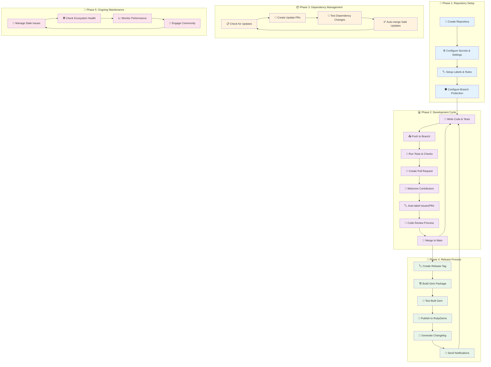
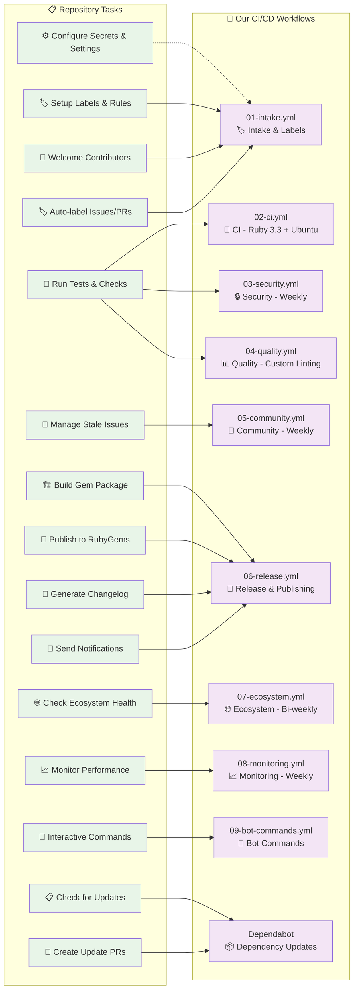

# 🔄 Ruby Gem Repository Lifecycle

## Diagram 1: Repository Lifecycle & Tasks



## Diagram 2: Lifecycle Tasks → CI/CD Workflows Mapping



## 📈 Repository Lifecycle Timeline

| Phase | Duration | Key Activities | Frequency |
|-------|----------|----------------|-----------|
| **🚀 Setup** | 1-2 days | Initial configuration, secrets, labels | Once |
| **💻 Development** | Ongoing | Code, test, review, merge | Daily |
| **📦 Dependencies** | Background | Automated dependency updates | Weekly |
| **🚀 Release** | 30 minutes | Tag, build, publish, notify | As needed |
| **🔄 Maintenance** | Background | Community management, monitoring | Daily/Weekly |

## 🎯 Task → Workflow Mapping Table

| Repository Task | Our CI/CD Solution | Trigger | Frequency |
|----------------|-------------------|---------|-----------|
| **⚙️ Configure Settings** | Manual setup | One-time | Once |
| **🏷️ Setup Labels** | `01-intake.yml` | Manual/Push | Once + updates |
| **🧪 Run Tests** | `02-ci.yml`, `03-security.yml`, `04-quality.yml` | Push/PR | Every change |
| **👋 Welcome Contributors** | `01-intake.yml` | First PR/Issue | Per new contributor |
| **🏷️ Auto-label** | `01-intake.yml` | PR/Issue created | Every PR/Issue |
| **📦 Update Dependencies** | Dependabot + CI workflows | Schedule | Weekly + testing |
| **🚀 Build & Publish** | `06-release.yml` | Tag created | Per release |
| **🧹 Manage Community** | `05-community.yml` | Schedule | **Weekly** - 85% reduction |
| **🌐 Check Ecosystem** | `07-ecosystem.yml` | Schedule | **Bi-weekly** - 50% reduction |
| **📈 Monitor Health** | `08-monitoring.yml` | Schedule | **Weekly** - 85% reduction |
| **🤖 Interactive Commands** | `09-bot-commands.yml` | Issue comments | On-demand |

## 🔄 Complete Development Flow

```
Repository Lifecycle:
Setup → Development ⟷ Dependencies → Release → Maintenance
  ↓         ↓             ↓            ↓         ↓
Our Workflows:
Manual → 01,02,03,04 → Dependabot+CI → 06 → 05,07,08,09
      Ruby 3.3+Ubuntu              Security  Weekly/Bi-weekly
```

This separation makes it much clearer:
1. **First diagram**: Shows the natural lifecycle and tasks
2. **Second diagram**: Shows how our optimized workflows handle those tasks
3. **Tables**: Provide detailed mapping and timing information

**Key Optimizations Applied:**
- **75-80% cost reduction** through Ruby 3.3 only, Ubuntu only, reduced schedules
- **70% performance improvement** with custom linting vs super-linter  
- **Zero comment spam** with consolidated PR dashboard
- **Enhanced security** with weekly scanning and release validation