# GitFlow Workflow Diagram

Visual representation of the GitFlow branching model used in gem-ci projects.

## Branch Flow Diagram

## Detailed GitFlow Process

## CI/CD Integration

```mermaid
flowchart LR
    subgraph "Branch Types"
        A[feature/*]
        B[bugfix/*]
        C[develop]
        D[release/*]
        E[hotfix/*]
        F[master]
    end
    
    subgraph "CI Workflows"
        G[02-ci.yml<br/>Basic Tests]
        H[03-security.yml<br/>Security Scan]
        I[04-quality.yml<br/>Code Quality]
        J[06-release.yml<br/>Release Process]
    end
    
    subgraph "Checks Required"
        K[✅ Ruby 3.3 Tests]
        L[✅ RuboCop Linting]
        M[✅ Security Scan]
        N[✅ Code Coverage]
    end
    
    A --> G
    B --> G
    C --> G
    C --> H
    C --> I
    D --> G
    D --> H
    D --> I
    E --> G
    E --> H
    F --> J
    
    G --> K
    I --> L
    H --> M
    G --> N
```

## Branch Protection Rules

```mermaid
flowchart TD
    subgraph "master Branch"
        A[🔒 Delete Protection]
        B[🔒 Force Push Protection]
        C[✅ Ruby 3.3 CI Required]
        D[✅ Code Quality Required]
        E[✅ Security Scan Required]
        F[👥 PR Review Required]
        G[✍️ Signed Commits Required]
    end
    
    subgraph "develop Branch"
        H[✅ Ruby 3.3 CI Required]
        I[✅ Code Quality Required]
        J[👥 PR Review Optional]
    end
    
    subgraph "feature/* Branches"
        K[🔓 No Protection]
        L[✅ CI Tests on PR]
    end
    
    subgraph "release/* Branches"
        M[✅ Ruby 3.3 CI Required]
        N[✅ Full Quality Suite]
        O[👥 PR Review Required]
    end
```

## Release Automation Flow

## Workflow Triggers Summary

| Branch Pattern | Workflow Triggered | Purpose |
|---------------|-------------------|---------|
| `feature/*` | CI on PR | Validate feature changes |
| `bugfix/*` | CI on PR | Validate bug fixes |
| `develop` | CI + Security + Quality | Integration validation |
| `release/*` | Full CI Suite | Pre-release validation |
| `hotfix/*` | CI + Security | Critical fix validation |
| `master` | Release Process | Production deployment |

This diagram shows how gem-ci integrates GitFlow with automated CI/CD for efficient Ruby gem development and deployment.