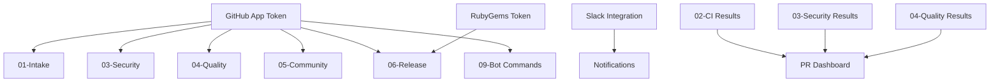

# 🔄 Workflow Overview

*Complete documentation of all 9 gem-ci workflows and their functionality*

## 🎯 Workflow Architecture

gem-ci includes **9 comprehensive workflows** that provide complete automation for Ruby gem development:

## 📋 Core Workflows

### **01 - Intake** (`01-intake.yml`)

**Purpose**: First contact and organization for issues and PRs

**Triggers**: 
- Issues: `opened`, `edited`, `reopened`
- Pull Requests: `opened`, `edited`, `reopened`, `synchronize`
- Push to: `.github/config/labels.yml`

**Key Features**:
- 🏷️ **Label Synchronization**: Syncs repository labels from config
- 🤖 **Auto-labeling**: Automatically labels PRs based on file changes
- 👋 **Welcome Messages**: Greets first-time contributors
- 📏 **PR Size Detection**: Labels PRs by size (XS, S, M, L, XL)

**Dependencies**: GitHub App authentication

---

### **02 - CI** (`02-ci.yml`)

**Purpose**: Continuous Integration with tests, linting, and builds

**Triggers**: 
- Push/PR to: `main`, `master`

**Key Features**:
- 🧪 **Ruby 3.3 Testing**: Optimized single-version testing
- 🏗️ **Gem Building**: Automated gem packaging
- 📊 **Parallel Jobs**: Lint, security, docs in parallel
- 📈 **Performance Tracking**: Workflow duration monitoring
- 📝 **PR Status Updates**: Contributes to consolidated PR dashboard

**Cost Optimization**: Ubuntu-only runners, Ruby 3.3 only

---

### **03 - Security** (`03-security.yml`)

**Purpose**: Comprehensive security scanning and vulnerability detection

**Triggers**: 
- Push/PR to: `main`, `master`
- Schedule: Weekly Wednesday 2 AM UTC

**Key Features**:
- 🔍 **CodeQL Analysis**: Static code analysis
- 🛡️ **Dependency Scanning**: Vulnerability detection in dependencies
- 🔐 **Secret Scanning**: Git history secret detection
- 📦 **Bundle Audit**: Ruby gem vulnerability scanning
- 📝 **PR Status Updates**: Contributes to consolidated PR dashboard

**Cost Optimization**: Reduced from daily to weekly

---

### **04 - Quality** (`04-quality.yml`)

**Purpose**: Code quality enforcement and documentation

**Triggers**: 
- Push/PR to: `main`, `master`

**Key Features**:
- 🔍 **Focused Linting**: Custom YAML/JSON/Markdown validation
- 💎 **RuboCop Analysis**: Ruby code style enforcement
- 📚 **Documentation Generation**: YARD API documentation
- 📊 **Complexity Analysis**: Code complexity reporting
- 📝 **PR Status Updates**: Contributes to consolidated PR dashboard

**Performance Improvement**: Replaced super-linter with focused custom linting (~70% faster)

---

### **05 - Community** (`05-community.yml`)

**Purpose**: Community management and engagement

**Triggers**: 
- Issues: `opened`, `edited`, `closed`, `reopened`
- Pull Requests: `opened`, `closed`
- Schedule: Weekly Tuesday 1 AM UTC

**Key Features**:
- 🧹 **Stale Management**: Automated stale issue/PR cleanup
- 👥 **Contributor Recognition**: Achievement badges for contributors
- 📈 **Community Health**: Health metrics and reporting
- 🏷️ **Smart Labeling**: Context-aware issue labeling

**Cost Optimization**: Reduced from daily to weekly

---

### **06 - Release** (`06-release.yml`)

**Purpose**: Automated releases and publishing

**Triggers**: 
- Push to: `main`, `master`
- Manual dispatch with release type selection

**Key Features**:
- 🎯 **Release Please**: Automated semantic versioning
- 💎 **Gem Building**: Automated gem packaging
- 🔒 **Security Scanning**: Pre-release security validation
- 📦 **RubyGems Publishing**: Automated gem publishing
- 📝 **GitHub Releases**: Automated release notes
- 📢 **Notifications**: Slack release announcements

**Dependencies**: RubyGems API key, release environment

---

### **07 - Ecosystem** (`07-ecosystem.yml`)

**Purpose**: Ecosystem health and compatibility monitoring

**Triggers**: 
- Push to: `main`, `master`
- Release events
- Schedule: Bi-weekly Sunday 3 AM UTC

**Key Features**:
- 📦 **Dependency Health**: Outdated dependency reporting
- 🧪 **Compatibility Matrix**: Ruby version compatibility testing  
- ⚡ **Performance Benchmarks**: Release performance validation
- 📚 **Documentation Links**: Link health checking
- 📊 **Health Issues**: Automated health issue creation/updates

**Cost Optimization**: Reduced from weekly to bi-weekly, Ruby 3.3 only

---

### **08 - Monitoring** (`08-monitoring.yml`)

**Purpose**: Performance monitoring and health tracking

**Triggers**: 
- Push/PR to: `main`, `master`
- Schedule: Weekly Monday 4 AM UTC

**Key Features**:
- 📈 **Workflow Metrics**: Performance and success tracking
- 🔍 **Action Analysis**: Basic workflow health monitoring
- 🏥 **Repository Health**: Overall repository health checks
- 📊 **Performance Summary**: Automated performance reporting

**Cost Optimization**: Reduced from daily to weekly

---

### **09 - Bot Commands** (`09-bot-commands.yml`)

**Purpose**: Interactive bot commands for workflow management

**Triggers**: 
- Issue comments containing `/gem-ci`

**Key Features**:
- 🔄 **Release Management**: `/gem-ci revise release minor to patch`
- ❌ **Release Cancellation**: `/gem-ci cancel release`
- 📚 **Help System**: `/gem-ci help`
- 🤖 **Interactive Responses**: Emoji reactions and helpful messages
- ⚠️ **Error Handling**: Invalid command guidance

**Dependencies**: GitHub App authentication

## 🔗 Workflow Dependencies

## 📊 Shared Actions

### **update-pr-status** (`.github/actions/update-pr-status`)

**Purpose**: Consolidated PR status comment management

**Used By**: CI, Security, Quality workflows

**Features**:
- 📝 Single PR status dashboard
- 🔄 Smart comment updates (no spam)
- 🔗 Direct links to workflow runs
- 📊 Status emoji indicators

---

### **Notification System** (`.github/workflows/shared/notification.yml`)

**Purpose**: Standardized Slack notifications

**Used By**: CI, Release, Quality workflows

**Features**:
- 🤖 Bot token authentication
- 🎨 Status-based color coding
- 📢 Channel-specific notifications
- 📊 Structured message format

## 🎯 Key Optimizations Applied

### **Cost Reductions** (~75-80% total savings)
- **Ruby Versions**: 3.3 only (50% reduction)
- **Platforms**: Ubuntu only (66% reduction)  
- **Schedules**: Reduced frequency (85% reduction)
- **Linting**: Custom focused approach (70% faster)

### **Performance Improvements**
- **PR Comments**: Single consolidated dashboard
- **Parallel Execution**: Optimized job dependencies
- **Smart Caching**: Efficient dependency caching
- **Focused Linting**: Targeted validation instead of super-linter

### **User Experience Enhancements**  
- **Interactive Commands**: Bot-driven workflow management
- **Clear Status**: Visual PR status dashboard
- **Smart Notifications**: Context-aware Slack messages
- **Documentation**: Comprehensive guides and examples

## 📚 Related Documentation

- [Local Testing Guide](../guides/local-testing) - Test workflows before deployment
- [Bot Commands Guide](../guides/bot-commands) - Interactive workflow management
- [Customization Guide](../guides/customization) - Adapt workflows for your needs
- [Architecture Diagrams](../diagrams/ci-workflow-overview) - Visual workflow overview

---

**Questions?** Check our [validation guide](../guides/validation) or [open an issue](https://github.com/patrick204nqh/gem-ci/issues) for help.